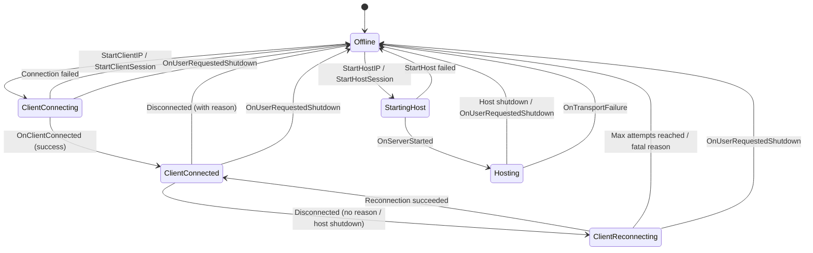
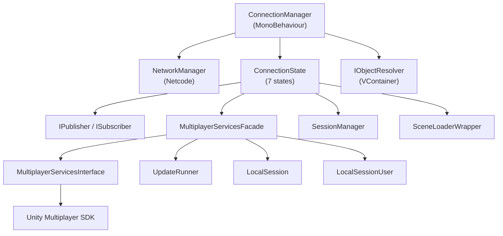

# Architecture Overview

[← Back to Index](index.md)

---

## Design Philosophy

The Connection Management system uses the **State Pattern** to model every phase of a multiplayer connection lifecycle. Each phase (offline, connecting, connected, hosting, reconnecting) is a separate class with clearly‑defined entry/exit logic and event handlers.

**Key principles:**
- **Single Responsibility** — Each state class handles only its own phase.
- **Dependency Injection** — All dependencies are injected via [VContainer](https://github.com/hadashiA/VContainer), enabling testability and loose coupling.
- **PubSub Messaging** — States communicate outward through `IPublisher<T>` / `ISubscriber<T>` channels, keeping them decoupled from UI or game logic.
- **Headless Design** — Zero UI code. The package provides pure logic; your game provides the visuals.

---

## State Machine Diagram

---

## Dependency Graph

---

## Layer Architecture

The package is organized into **four layers**, ordered from most fundamental to most specific:

| Layer | Namespace | Responsibility |
|-------|-----------|----------------|
| **Infrastructure** | `Unity.ConnectionManagement.Infrastructure` | Generic utilities: PubSub, UpdateRunner, NetworkGuid |
| **Utils** | `Unity.ConnectionManagement.Utils` | Connection-specific helpers: ClientPrefs, ProfileManager, SceneLoaderWrapper |
| **Unity Services** | `Unity.ConnectionManagement.UnityServices.*` | Abstraction over Unity Gaming Services (Sessions, Relay, Authentication) |
| **Core** | `Unity.ConnectionManagement` | The state machine itself: ConnectionManager, all ConnectionStates, ConnectionMethods |

**Dependency rule:** Each layer may depend on the layers below it, but never on layers above.

---

## Injection Flow

1. **Your game's `LifetimeScope`** (VContainer) registers all necessary dependencies.
2. `ConnectionManager.Start()` uses `IObjectResolver.Inject()` to inject all 6 state objects.
3. Each state receives its dependencies (e.g., `MultiplayerServicesFacade`, `IPublisher<T>`) via `[Inject]` attributes.
4. `MultiplayerServicesFacade.Start()` creates a child `LifetimeScope` to resolve `MultiplayerServicesInterface`.

See [Integration Guide](integration-guide.md) for a working example.

---

## Threading Model

| Component | Thread | Notes |
|-----------|--------|-------|
| `ConnectionManager` | Main Thread | MonoBehaviour, receives Netcode callbacks |
| `ConnectionState.*` | Main Thread | All state transitions happen on main thread |
| `MultiplayerServicesFacade` | Main + Async | Session API calls are `async/await` but results arrive on main thread |
| `ClientReconnectingState` | Main Thread | Uses `Coroutine` + `WaitForSeconds` for retry delays |
| `UpdateRunner` | Main Thread | Runs in `Update()`, calls subscribers at configurable intervals |
